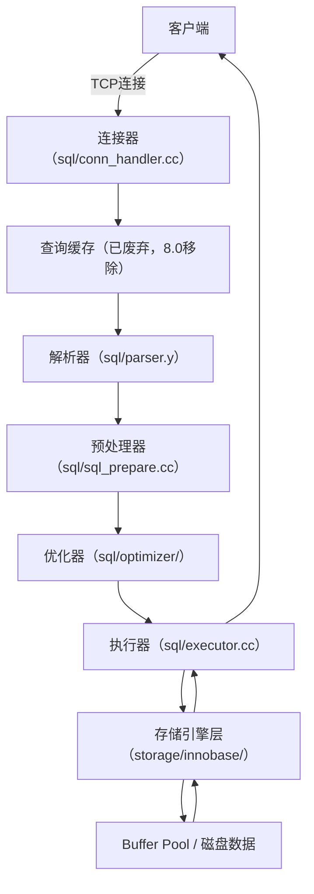

对于MySQL初学者而言，我们每天写的SELECT语句，看似只是简单的“查数据”，背后却隐藏着MySQL内核复杂的执行逻辑。很多人只会写SQL，却不懂其执行过程，遇到性能瓶颈时无从下手——比如为什么同样的查询，换个索引就快了？为什么有些查询会频繁访问磁盘？

本章我们就从零开始，结合MySQL源码（基于8.0版本），深度拆解SELECT语句的完整执行过程，从连接器到存储引擎，每一个阶段都讲透原理、结合实例，帮你真正理解“MySQL是怎么查数据的”，为后续SQL优化、性能调优打下坚实基础。

## 🧩 一、整体流程概览：Server层与存储引擎层的分工

在解析具体执行步骤前，我们先明确MySQL的核心架构——整个MySQL服务分为两大核心层级，二者分工明确、协同工作，这也是理解SELECT执行过程的关键。

核心分工如下：

- **Server 层（SQL 层）**：这是MySQL的“大脑”，负责处理SQL语句的整个逻辑流程，包括连接管理、SQL解析、优化、执行调度等，不直接负责数据的存储和读取。简单说，Server层决定“查什么”“怎么查”。
    
- **存储引擎层（Engine 层）**：这是MySQL的“手脚”，负责数据的实际存取、事务管理、索引维护等，完全依赖Server层的调度。常见的存储引擎有InnoDB（MySQL 8.0默认）、MyISAM等，不同存储引擎的存取逻辑不同，但对外提供统一的接口给Server层。简单说，存储引擎层负责“去磁盘/内存拿数据回来”。
    

结合源码来看，Server层的核心代码集中在`sql/`目录下（如连接器、解析器、优化器相关源码），而存储引擎层的代码集中在`storage/`目录下（如InnoDB的`storage/innobase/`目录），二者通过`handler.h`定义的接口进行通信，解耦性极强。

举个通俗的类比：Server层就像餐厅的“点餐员”，负责接收顾客（客户端）的订单（SQL语句），确认订单合法性、优化点餐方案（执行计划），然后将订单传递给后厨（存储引擎层）；后厨负责按照订单制作菜品（读取数据），再将菜品交给点餐员，最终传递给顾客。

## ⚙️ 二、执行流程的7个核心阶段（结合源码+实例深度解析）

为了让大家更直观理解，我们以一条最常见的SELECT语句为例，全程拆解其执行过程：

```sql
SELECT name FROM user WHERE id = 1;
```

这条语句的核心需求是“从user表中，查询id=1的记录的name字段”，接下来我们一步步看MySQL内部如何处理这条SQL，每个阶段都结合源码细节和实际场景解析。

### ① 连接器（Connection Manager）：建立连接，身份校验

当客户端（比如Navicat、Java应用中的JDBC、Python的pymysql）发起连接请求时，MySQL首先由**连接器**处理，这是整个执行流程的第一步，也是所有SQL语句（不仅是SELECT）的必经阶段。

连接器的核心工作的有3件事（结合源码`sql/conn_handler.cc`）：

1. **建立TCP连接**：MySQL客户端与服务端通过TCP协议通信，默认端口3306。连接器会监听端口，接收客户端的TCP连接请求，完成三次握手，建立稳定的连接。
    
2. **身份校验**：连接建立后，客户端会发送用户名、密码，连接器会校验其合法性——查询MySQL系统库（mysql库）中的user表，确认用户名、密码是否匹配，同时校验该用户是否有访问目标数据库、执行对应操作的权限（如SELECT权限）。若校验失败，直接返回错误（如“Access denied for user”），关闭连接；若校验成功，进入下一步。
    
3. **分配线程与状态管理**：校验通过后，MySQL会为该连接分配一个独立的线程（通过线程池管理，避免频繁创建/销毁线程），后续该客户端的所有请求，都由这个线程处理。同时，连接器会记录该连接的状态（如空闲、正在执行SQL）。
    

🧠 核心知识点（源码关联+实战重点）：

- **长连接与短连接**：短连接是每次执行SQL都建立连接、执行完成后关闭连接，频繁建立/销毁TCP连接会消耗大量资源；长连接（连接池实现，如Java中的Druid连接池）可以复用连接，避免频繁握手，提升效率。
    
- **长连接的内存膨胀问题**：MySQL的连接线程会缓存会话相关的上下文信息（如临时表、变量），长连接长时间不释放，会导致内存占用持续增加，甚至出现OOM。源码中提供了`mysql_reset_connection()`接口，可在不关闭连接的情况下，重置连接的上下文状态（无需重连、无需重新校验权限），解决内存膨胀问题，这也是实战中常用的优化手段。
    

### ② 查询缓存（Query Cache）【MySQL 8.0 已移除】

这里需要重点说明：查询缓存在MySQL 8.0版本中已被彻底移除，官方给出的原因是“缓存命中率低、维护成本高”，因此我们无需深入研究，但需要了解其历史作用，避免被旧版本教程误导。

在MySQL 5.7及之前的版本中，连接器校验通过后，会先检查这条SQL是否在查询缓存中——查询缓存会存储“SQL语句”与“查询结果”的映射关系，若SQL完全匹配（大小写、空格都必须一致），则直接返回缓存中的结果，跳过后续所有阶段。

但查询缓存有一个致命缺陷：只要该SQL涉及的表发生任何更新（INSERT、UPDATE、DELETE），所有与该表相关的查询缓存都会被清空，导致缓存命中率极低，反而会因为缓存的维护（增删改查缓存项）消耗额外资源。因此，MySQL 8.0直接移除了该模块，源码中`sql/query_cache.cc`等相关文件也已被删除。

📌 实战提醒：若你使用的是MySQL 5.7及以下版本，建议直接关闭查询缓存（通过`query_cache_type=0`配置），避免影响性能。

### ③ 解析器（Parser）：SQL拆解与语法校验

跳过查询缓存（或直接进入该阶段，MySQL 8.0）后，SQL语句会进入**解析器**，核心作用是“理解SQL语句的含义”，相当于给MySQL“翻译”SQL。解析器的工作分为两步（结合源码`sql/parser.y`，基于YACC语法分析器）：

1. **词法分析（Lexical Analysis）**：将SQL语句拆分成一个个独立的“token”（词元），比如将`SELECT name FROM user WHERE id = 1;`拆分为：SELECT、name、FROM、user、WHERE、id、=、1 这些token，同时识别出每个token的类型（如SELECT是关键字、name是字段名、user是表名、1是常量）。
    
2. **语法分析（Syntactic Analysis）**：根据MySQL的SQL语法规则，将拆分后的token组合成“语法树（Parse Tree）”，同时校验SQL的语法是否正确——比如是否缺少关键字（如SELECT写成SELEC）、括号是否匹配、关键字顺序是否正确（如FROM写在SELECT前面）。若语法有误，解析器会直接返回错误信息（如“You have an error in your SQL syntax”），终止执行。
    

🧠 类比理解：解析器的工作就像编译器编译源代码——先把代码拆分成关键字、变量、运算符（词法分析），再检查代码是否符合语法规则（语法分析），若语法错误，编译器会报错。

源码细节：解析器生成的语法树，会传递给下一个阶段（预处理器），语法树的结构定义在`sql/sql_parse.h`中，每个节点对应SQL中的一个组成部分（如SelectStmt、WhereClause等）。

### ④ 预处理器（Preprocessor）：合法性校验与优化准备

解析器生成语法树后，并不直接进入优化阶段，因为此时语法树只解决了“语法正确”，但还未确认“语义合法”——比如表是否存在、字段是否存在、用户是否有操作权限等。预处理器的核心工作就是做这些“语义校验”，同时对语法树进行初步优化（结合源码`sql/sql_prepare.cc`）。

预处理器的核心操作有4点：

1. **表和字段合法性校验**：检查SQL中涉及的表（如user表）、字段（如name、id字段）是否存在于目标数据库中。根据源码逻辑，若表或字段不存在，会在这个阶段报错（如“Unknown table 'user'”“Unknown column 'name' in 'field list'”）——这里需要注意：语法分析阶段只检查语法，不检查表/字段是否存在，语义校验是预处理器的核心职责。
    
2. **权限二次校验**：再次校验当前用户是否有操作该表、该字段的权限（如是否有user表的SELECT权限），避免因权限变更导致的安全问题。
    
3. **消除歧义**：若SQL中出现歧义（如多表连接时，字段名重复），预处理器会根据表的别名、字段的归属，明确字段的具体来源，避免后续优化和执行时出错。
    
4. **语法树优化**：最常见的优化是将`SELECT *`替换为表中的所有字段（根据表结构，读取information_schema库中的列信息），为后续优化器的工作做准备。
    

举个例子：若执行`SELECT * FROM user WHERE id = 1;`，预处理器会先检查user表是否存在、id字段是否存在，然后将`*`替换为user表的所有字段（如id、name、age等），生成优化后的语法树，传递给优化器。

### ⑤ 优化器（Optimizer）：选择最优执行计划（核心阶段）

预处理器处理完成后，语法树已经是“合法、可执行”的，但MySQL并不会直接执行——因为同一条SQL，可能有多种执行方式，不同执行方式的性能差异可能天差地别。优化器的核心作用，就是“在众多执行方式中，选择最优的执行计划”，这也是MySQL“智能”的核心体现（结合源码`sql/optimizer/`目录下的相关文件）。

优化器的核心任务的有4点，也是实战中SQL优化的关键切入点：

1. **选择合适的索引**：这是优化器最核心的工作。比如我们的示例`SELECT name FROM user WHERE id = 1;`，优化器会判断id字段是否有索引（主键索引、普通索引），若有主键索引，会选择主键索引查询（因为主键索引的查询效率最高）；若没有索引，会选择全表扫描。
    
2. **确定表连接顺序**：若SQL涉及多表连接（如JOIN），优化器会计算不同表连接顺序的执行成本（如先连接A表再连接B表，还是先连接B表再连接A表），选择成本最低的连接顺序。
    
3. **利用索引覆盖**：若查询的字段都包含在索引中（即覆盖索引），优化器会直接从索引中读取数据，无需回表（从聚簇索引中读取完整行数据），大幅提升查询效率。比如我们的示例中，若name字段包含在id主键索引中（InnoDB主键索引是聚簇索引，存储完整行数据，因此包含name字段），优化器会直接从主键索引中读取name，无需回表。
    
4. **查询重写与常量折叠**：优化器会对SQL进行重写，将复杂的SQL转换为更高效的形式；同时会进行常量折叠（如`WHERE id = 1+1`，会被优化为`WHERE id = 2`），减少执行时的计算成本。
    

📘 实战示例（优化器决策演示）：

假设执行`SELECT * FROM user WHERE age > 20 AND name = 'Tom';`，user表中name字段有普通索引，age字段没有索引。此时优化器会分析：name字段的索引选择性更高（name='Tom'能过滤出更少的记录），因此会决定“先通过name索引过滤出name='Tom'的记录，再对这些记录判断age > 20”，而不是先过滤age > 20（全表扫描）。

🧠 如何查看优化器的决策？

我们可以使用`EXPLAIN`关键字，查看优化器生成的执行计划，了解索引使用情况、行扫描数、执行方式等，这是实战中SQL优化的核心工具：

```sql
EXPLAIN SELECT * FROM user WHERE age > 20 AND name = 'Tom';
```

执行后，通过`type`字段（如ref表示使用索引）、`key`字段（显示使用的索引名称）、`rows`字段（预计扫描的行数），就能判断优化器的决策是否合理。

源码细节：优化器的核心是“成本计算模型”，通过计算不同执行计划的I/O成本、CPU成本，选择成本最低的计划。成本计算的逻辑定义在`sql/optimizer/costmodel.cc`中，主要基于表的统计信息（如行数、索引选择性）进行计算。

### ⑥ 执行器（Executor）：调度执行，协调存储引擎

优化器生成最优执行计划后，就会交给**执行器**，执行器的核心作用是“按照执行计划，调用存储引擎的接口，获取数据并返回”，相当于“指挥存储引擎干活”（结合源码`sql/executor.cc`）。

执行器的工作流程，我们结合“索引下推”（InnoDB的核心优化特性）来详细解析——索引下推能大幅减少回表次数，提升查询效率，也是执行器与存储引擎协同工作的典型案例。

#### 前提假设（便于理解）：

假设我们有t_user表，表结构如下：

- 主键：id（聚簇索引，存储完整行数据，包含id、age、reward三个字段）；
    
- 二级索引：idx_age（联合索引，包含age列和reward列，即索引中存储了age和reward的值，无需回表就能获取这两个字段的值）；
    

表中数据（简化）：

|id|age|reward|
|---|---|---|
|1|21|50000|
|2|22|100000|
|3|23|80000|
|4|24|100000|
|5|25|120000|

我们执行查询：`SELECT * FROM t_user WHERE age > 20 AND reward = 100000;`

有索引下推时，执行器与存储引擎的协同流程如下（核心是“将部分过滤条件提前到存储引擎层，减少回表”）：

1. **步骤1：Server层发起查询，定位初始记录**：执行器根据优化器的执行计划，调用InnoDB的接口，要求找到满足`age > 20`的第一条二级索引（idx_age）记录——即age=21对应的索引项（包含age=21、reward=50000、id=1）。
    
2. **步骤2：存储引擎层提前过滤reward条件**：InnoDB定位到age=21的二级索引记录后，不立即回表（回表即根据id=1到聚簇索引中读取完整行数据），而是先检查索引中包含的reward列——该记录的reward=50000，不满足`reward = 100000`，因此直接跳过这条索引记录，无需回表，减少一次磁盘I/O。
    
3. **步骤3：遍历下一条索引记录，重复过滤**：InnoDB继续取下一条满足`age > 20`的索引记录（age=22，reward=100000，id=2），检查索引中的reward=100000，满足条件，此时执行回表操作——根据id=2到聚簇索引中取出完整行数据（id=2, age=22, reward=100000），返回给执行器。
    
4. **步骤4：Server层最终校验并返回**：执行器拿到回表后的完整行数据，检查所有查询条件（此时只剩最终校验，通常已符合条件），将该记录暂存，准备返回给客户端。
    
5. **步骤5：继续遍历剩余索引记录**：InnoDB继续遍历后续满足`age > 20`的索引记录，重复步骤2-4：
    
    1. age=23（reward=80000）：不满足，跳过，不回表；
        
    2. age=24（reward=100000）：满足，回表，返回给执行器；
        
    3. age=25（reward=120000）：不满足，跳过，不回表。
        

🧩 执行器与存储引擎的核心关系：

执行器只管“要什么数据”（按照执行计划，告诉存储引擎需要哪些数据），不关心“怎么取数据”；存储引擎负责“怎么取数据”（根据索引、缓存等，高效获取数据），并将数据返回给执行器。二者通过统一的接口（handler接口）通信，完全解耦。

### ⑦ 存储引擎层（Engine Layer）：数据存取的最终实现

执行器调用存储引擎的接口后，就进入了存储引擎层，这里我们以MySQL 8.0默认的InnoDB存储引擎为例，解析数据的存取过程（结合源码`storage/innobase/`目录）。

InnoDB存储引擎的核心工作流程（数据读取）：

1. **根据索引定位数据页**：InnoDB的数据是以“页”为单位管理的（默认页大小16KB），存储引擎会根据执行器传递的条件（如id=1、age>20），通过索引（B+树结构）定位到对应的“数据页”——主键索引的B+树叶子节点存储完整行数据，二级索引的B+树叶子节点存储索引列值和主键id。
    
2. **检查Buffer Pool（内存缓存）**：InnoDB会先检查该数据页是否在Buffer Pool（InnoDB的内存缓存区域）中——Buffer Pool是InnoDB的核心缓存，用于缓存热数据（频繁访问的数据页），减少磁盘I/O。若数据页在Buffer Pool中，直接从内存中读取数据，返回给执行器；若不在内存中，进入下一步。
    
3. **从磁盘加载数据到Buffer Pool**：存储引擎从磁盘中读取对应的 data 数据页，加载到Buffer Pool中（同时会缓存该数据页，方便后续查询复用），然后从Buffer Pool中读取数据，返回给执行器。
    
4. **返回数据**：存储引擎将读取到的行数据（或索引数据）返回给执行器，执行器汇总所有符合条件的记录，最终返回给客户端。
    

🧠 核心知识点：Buffer Pool（InnoDB缓存核心）

- Buffer Pool的大小由`innodb_buffer_pool_size`参数控制，默认大小较小（如128M），实战中建议调大（如服务器内存的50%-70%），让更多热数据命中内存，减少磁盘I/O（磁盘I/O是MySQL查询的主要性能瓶颈）。
    
- Buffer Pool的缓存机制类似于操作系统的页缓存，采用LRU（最近最少使用）算法，淘汰不常用的数据页，保留常用的热数据。
    

## 🔍 三、整个执行流程图（简化版+源码关联）

为了让大家更清晰地梳理整个流程，我们用简化的流程图，结合源码目录，总结SELECT语句的完整执行路径：



补充说明：流程图中每个阶段对应的源码目录，方便大家后续深入研究源码时快速定位核心文件，新手可先重点理解流程，无需急于看源码。

## 🚀 四、性能优化角度总结（实战重点）

理解SELECT语句的执行过程，最终目的是为了优化查询性能。结合上面的7个阶段，我们总结5个核心优化方向，每一个都对应执行过程中的关键节点：

1. **连接层优化**：使用连接池（如Druid、HikariCP），复用长连接，避免频繁创建/销毁TCP连接；同时定期调用`mysql_reset_connection()`，解决长连接内存膨胀问题。
    
2. **SQL优化**：使用`EXPLAIN`查看执行计划，确认优化器是否使用了合适的索引；避免使用`SELECT *`，减少字段读取和传输成本；优化WHERE条件，让优化器能选择最优索引。
    
3. **索引优化**：建立合适的索引（主键索引、联合索引、覆盖索引），提升索引选择性；利用索引下推特性，减少回表次数；避免索引失效（如函数操作索引列、模糊匹配%开头等）。
    
4. **缓存优化**：MySQL 8.0已移除查询缓存，建议使用应用层缓存（如Redis），缓存频繁查询的结果（如热点数据），减少MySQL的查询压力。
    
5. **内存优化**：调大`innodb_buffer_pool_size`，让更多数据页缓存到内存中，减少磁盘I/O；合理设置`innodb_log_buffer_size`等参数，优化日志写入性能。
    

## 🧭 五、完整示例总结（回顾全程）

我们再回到最开始的示例`SELECT name FROM user WHERE id = 1;`，结合整个执行流程，完整回顾一遍，加深理解：

1. 客户端通过TCP连接到MySQL服务端（默认3306端口）；
    
2. 连接器接收连接，校验用户名、密码和权限，分配线程；
    
3. 跳过查询缓存（MySQL 8.0），SQL进入解析器，拆分成token，生成语法树，校验语法；
    
4. 预处理器校验user表、name和id字段是否存在，校验用户权限，将语法树优化后传递给优化器；
    
5. 优化器分析执行计划，确定使用id主键索引（最优方案）；
    
6. 执行器调用InnoDB接口，要求读取id=1的记录；
    
7. InnoDB在Buffer Pool中查找id=1对应的数据页，若存在，直接读取name字段；若不存在，从磁盘加载数据页到Buffer Pool，再读取name字段；
    
8. InnoDB将name字段数据返回给执行器，执行器汇总结果，返回给客户端；
    
9. 客户端接收结果并显示，连接保持（长连接）或关闭（短连接）。
    

## 总结

SELECT语句的执行过程，本质是MySQL Server层与存储引擎层协同工作的过程——从连接建立、SQL解析，到优化器选择最优计划、执行器调度，再到存储引擎读取数据，每一个阶段都有其核心职责，也都有对应的优化空间。

对于新手而言，无需一开始就深入研究源码，重点是理解“7个核心阶段”的分工和逻辑，知道每一步MySQL在做什么；对于有一定基础的开发者，结合源码进一步研究优化器、存储引擎的实现细节，能让你在SQL优化、性能调优时更有底气。

下一章，我们将结合本章的执行过程，重点讲解“索引优化实战”，教你如何通过优化索引，让SELECT查询速度提升10倍甚至100倍，敬请关注～
